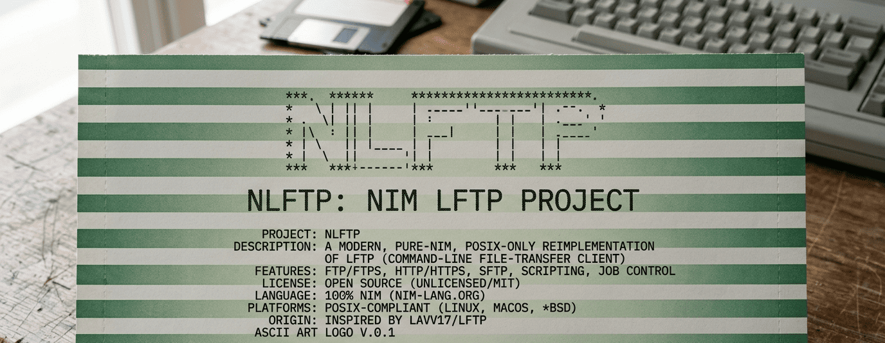

    
# nlftp

Copyright (C) 2026 - Luciano Federico Pereira

A modern, **pure-Nim**, **POSIX-only** reimplementation of
[lftp](https://github.com/lavv17/lftp) — the sophisticated command-line

file-transfer client (FTP/FTPS, HTTP/HTTPS, SFTP).
`nlftp` ("Nim lftp") is **based on lftp 4.9.3's design but heavily
re-architected under the hood**: lftp's hand-rolled cooperative scheduler,
custom containers, gnulib portability layer, and autotools build are gone,
replaced by Nim's stdlib + [chronos](https://github.com/status-im/nim-chronos)
async. Transfers stream with constant memory, run in parallel, and several
long-standing upstream bugs are fixed by design. It is **not** a line-by-line
port — it's a clean reimplementation that preserves lftp's command surface and
behavior. (Unrelated to the older [Ayukov NFTP](http://www.ayukov.com/nftp/)
or other `nftp` clients.)

> **Status: working multi-protocol client.**
> `nlftp` connects, lists, transfers, and mirrors over **FTP/FTPS**, **HTTP/HTTPS**,
> and **local files**, with **SFTP** in beta.

## Script-only (no interactive mode)

nlftp runs scripts, not an interactive prompt — `.nlftp` files, inline `-c`, or
piped stdin. (This is deliberate: it drops the readline/line-editor subsystem.)

```sh
nlftp script.nlftp                 # run a script file
nlftp -f script.nlftp              # explicit
nlftp -c "open ftp://ftp.gnu.org; cd /gnu/hello; get hello-2.12.tar.gz"
echo "open https://example.com/; get / -o i.html" | nlftp   # stdin
```

A `.nlftp` script (make it `chmod +x` and the shebang runs it):

```
#!/usr/bin/env nlftp
open ftp://ftp.gnu.org
cd /gnu/hello
lcd ./downloads
mirror . hello
exit
```

- **FTP/FTPS** — login, EPSV/PASV, LIST/RETR/STOR, dir ops (verified live vs
  ftp.gnu.org, byte-exact binary transfers).
- **HTTP/HTTPS** — GET, redirects, chunked/content-length, HTML autoindex
  listing, cert verification (verified live vs example.com, ftp.gnu.org).
- **mirror** — recursive sync over any backend (verified: 45-file FTP tree,
  byte-exact; skip-unchanged; `--delete`).
- **SFTP** — `ssh -s sftp` v3, codec unit-tested; live file-ops path beta.
- **shell** — `ls cd get put mget mput mirror cat mkdir rm mv chmod set alias
  open close !cmd`, `-c` scripts, `;`-separated commands.

Run the test suite: `nimble test` (60+ tests).

## Why

A from-scratch reimplementation on a modern runtime ([chronos](https://github.com/status-im/nim-chronos)
async) that deletes lftp's hand-rolled cooperative scheduler, custom containers,
gnulib portability layer, and autotools build — replacing them with Nim's stdlib
and pure-Nim libraries. The rewrite also fixes several long-standing upstream bugs
*by design* (see [`docs/inventory/09-open-issues-triage.md`](docs/inventory/09-open-issues-triage.md)).

## Design decisions

See [`docs/DECISIONS.md`](docs/DECISIONS.md). Highlights:
- **chronos** replaces lftp's `SMTask` cooperative scheduler (same single-threaded
  model, modern async/await).
- **Pure-Nim libraries preferred**; system-library wrappers only where no pure-Nim
  option exists (TLS, ssh). **No C source in this repo.**
- **POSIX-only** (Linux/macOS/Unix).
- Scope-trimmed: FXP, plugin modules, SOCKS, DNSSEC, **BitTorrent/DHT, and FISH
  removed entirely**. Supported protocols: FTP/FTPS, HTTP/HTTPS (+WebDAV), SFTP.

## Layout

```
nlftp/        Nim source (core/ fs/ proto/ jobs/ shell/)
tests/        test suites
docs/         Third-Party Notices
```

## Build

Requires Nim ≥ 2.0 and Nimble.

```sh
nimble build          # produces ./bin/nlftp
nim c -r tests/test_core.nim   # run the test suite
```

## License

GPL-3.0-or-later. nlftp is a derivative work of lftp (GPLv3) and remains GPLv3.
